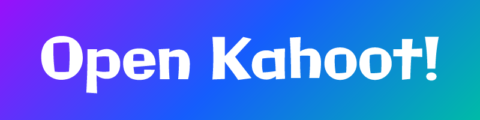

A real-time multiplayer quiz game inspired by Kahoot!, built with Next.js, Socket.io, and TypeScript.

## Setup

1. Clone the repository and install dependencies:
```bash
npm install
```

2. Create a `.env.local` file in the root directory with the following variable:
```
NEXT_PUBLIC_APP_URL=http://localhost:3000
```

3. Start the development server:
```bash
npm run dev
```

The application will be available at `http://localhost:3000`.

## Available Scripts

- `npm run dev` - Start development server
- `npm run build` - Build for production
- `npm run start` - Start production server
- `npm run lint` - Run ESLint
- `npm run test` - Run unit tests
- `npm run test:watch` - Run tests in watch mode
- `npm run test:coverage` - Run tests with coverage report
- `npm run test:e2e` - Run end-to-end tests

## Technology Stack

- **Frontend**: Next.js 15, React 19, TypeScript
- **Real-time Communication**: Socket.io
- **Styling**: Tailwind CSS 4
- **Animation**: Framer Motion
- **Testing**: Jest, Playwright
- **Icons**: Lucide React

## Contributing

1. Fork the repository
2. Create a feature branch: `git checkout -b feature-name`
3. Make your changes and add tests if applicable
4. Run the test suite: `npm test`
5. Run the linter: `npm run lint`
6. Commit your changes: `git commit -m 'Add feature'`
7. Push to your branch: `git push origin feature-name`
8. Create a Pull Request

Please ensure your code follows the existing style and includes appropriate tests.

## Disclaimers

**Not affiliated with Kahoot!**: This project is not affiliated with, endorsed by, or connected to Kahoot! AS or any of its subsidiaries. Kahoot! is a trademark of Kahoot! AS.

**AI-assisted development**: A significant portion of this codebase has been developed with the assistance of AI tools.

## License

This project is licensed under the GNU Affero General Public License v3.0 (AGPL-3.0). See the [LICENSE.md](LICENSE.md) file for details.
